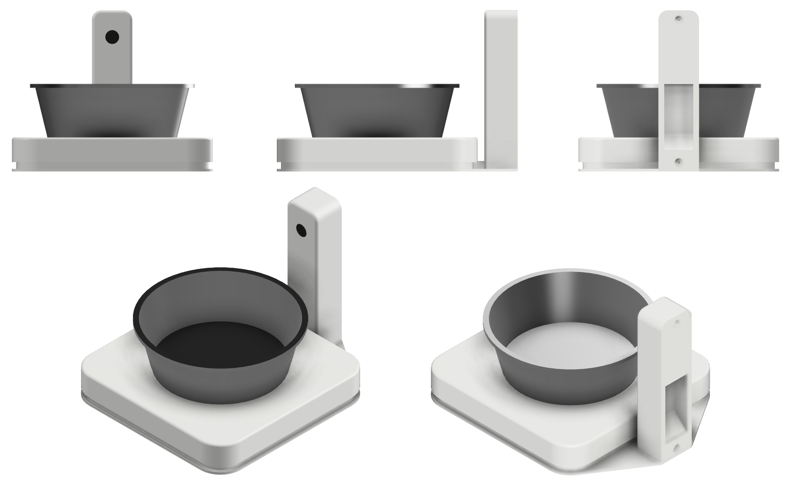
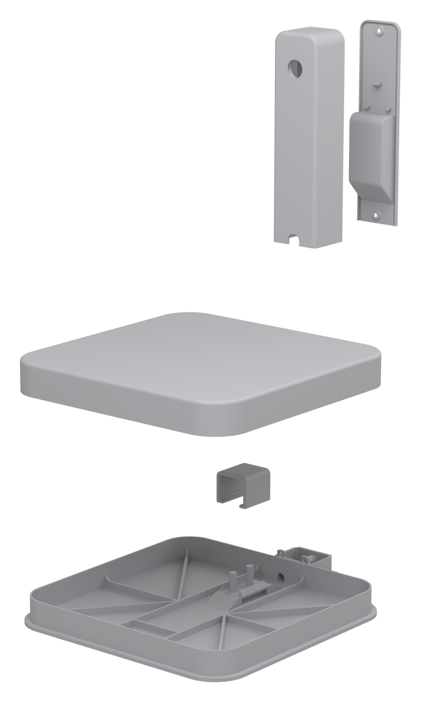
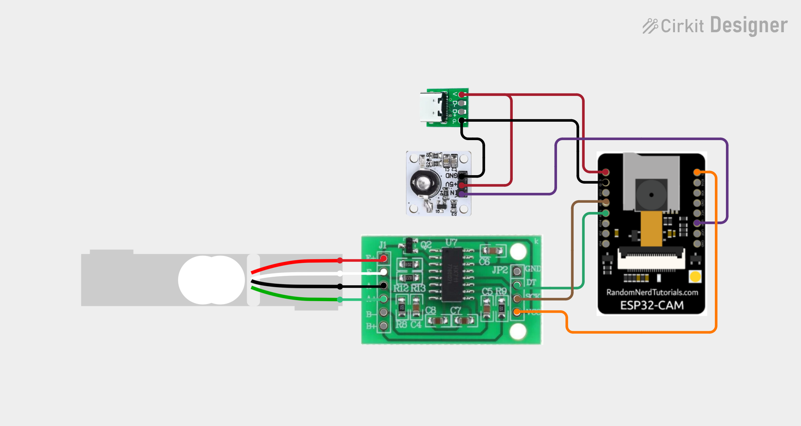

# @oddware/esphome.pet-bowl-monitor

ESPHome firmware and printed hardware for a cat water bowl monitor. A load
cell under the bowl tracks water level and drinking events; an ESP32-CAM
with IR lighting looks down into it. Reports to Home Assistant over the
native API — local-only, no cloud.



## Why

The smaller cat around here can't use the
[Eversweet fountain](../esphome.petkit-eversweet-3-pro) — it's tall, and she
chokes on her own water often enough that she prefers a low bowl. No running
fountain sits low enough, so her bowl is refilled by hand. This project puts
that bowl on a scale so the drinks still get logged.

## What it does

- Water weight and fill level (mL and %) from a 1 kg load cell + HX711
- Drinking events with volume and duration
- Camera stream over the bowl, with IR night vision during drinks
- White-light alerts for empty bowl, missing bowl, and overdue water change
- Water-change detection when you lift and refill the bowl

## How it works

- A drink is a weight rate-of-change above 10 mL/min, sampled every 2 s.
  The event ends 15 s after the rate settles, then volume and duration
  publish. Events under 1 mL or 1 s are dropped.
- Slow drift — evaporation, temperature — never crosses the rate threshold.
- The bowl coming off the scale and back on — stable weight dropping below
  bowl weight + 5 g, then rising above it — counts as a water change and
  resets the reminder.
- Drinking in the dark turns on the IR LED and switches the camera to
  grayscale. Darkness is read from the camera's own exposure register;
  there is no separate light sensor.
- The white LED signals empty bowl, missing bowl, and overdue water change.

## Telling the cats apart

The `Pet Drinking` event triggers a snapshot, and a vision model (Gemma 4
here; Home Assistant can also do it natively) identifies the cat. Per-cat
totals go to [cat-health](https://github.com/cristianchelu/cat-health).

## Home Assistant entities

| Entity | Type | Notes |
|--------|------|-------|
| Water Amount | sensor, mL | Stable weight minus `Bowl Weight` |
| Water Level | sensor, % | Water Amount as % of `Bowl Capacity` |
| Last Drink Amount / Duration | sensor | Published per qualifying drink |
| Water Last Changed | sensor, timestamp | |
| Water Rate of Change | sensor, mL/min | Diagnostic; what drinking detection watches |
| Light Level | sensor | The camera's auto-exposure average; gates the IR |
| Scale / Unfiltered Weight | sensor, g | Diagnostic, Unfiltered disabled by default |
| Calibration Last Performed | sensor, timestamp | Diagnostic |
| WiFi Signal | sensor, dBm | Diagnostic |
| Activity | binary_sensor | Motion class, `delayed_off` 15 s |
| Bowl Missing / Bowl Empty / Water Change Overdue | binary_sensor | Problem class; drive the white-light alerts |
| Vibration Detected | binary_sensor | Diagnostic; consecutive readings differ by more than 1 g |
| IR LED Active | binary_sensor | Diagnostic |
| Camera | camera | |
| White Light | light | The flash LED; doubles as the alert channel |
| Red LED | light | The board's onboard status LED |
| IR LED | switch | Diagnostic, disabled by default — manual override |
| Bowl Weight / Bowl Capacity | number | Match your bowl |
| Water Reminder Interval | number, h | |
| Calibration Known Weight | number, g | |
| Brightness | select | Alert brightness, Off / Low / Medium / High |
| Set Zero (Tare) / Calibrate with Known Weight | button | |
| Pet Drinking | event | Fired per qualifying drink |

## Build

### Print



| Part | File | Bounding box | What it does |
|------|------|--------------|--------------|
| Base | [`base.3mf`](models/base.3mf) | 180.0 × 150.0 × 19.0 mm | Bottom of the scale. The load cell and platform mount here; the tower bolts on too. |
| Load cell clip | [`load_cell_clip.3mf`](models/load_cell_clip.3mf) | 22.0 × 21.1 × 18.3 mm | Presses the load cell onto the base. No screw. |
| Platform | [`platform.3mf`](models/platform.3mf) | 150.0 × 150.0 × 18.9 mm | Top of the scale. Your bowl sits here. |
| Tower shell | [`tower_shell.3mf`](models/tower_shell.3mf) | 25.0 × 30.4 × 118.5 mm | Holds the ESP32-CAM, camera module, IR LED, and HX711. |
| Tower back cover | [`back_cover.3mf`](models/back_cover.3mf) | 14.0 × 27.4 × 116.9 mm | Closes the tower and mounts the USB-C breakout. Takes the build's only two screws. |

Plain PLA. The `.3mf` files are mesh exports, not slicer projects — use your
own print settings. To modify the design, start from the Fusion archive,
[`models/pet_bowl_monitor.f3z`](models/pet_bowl_monitor.f3z); its material
preset says ABS, ignore that.

### Buy

Check that substitutes fit the printed parts before you order.

| Role | Part | Notes | Supplier |
|------|------|-------|----------|
| Compute | ESP32-CAM (no camera module) | Order board only; fit the OV2640 separately | [AliExpress](https://www.aliexpress.com/item/1005006137530316.html) |
| Camera | OV2640, 21 mm, 160° FOV | Must be modded no-IR-cut | [AliExpress](https://www.aliexpress.com/item/1005007291555550.html) |
| IR lighting | 940 nm IR LED, 1 W | Firmware caps PWM at 30 % (`ir_led_max_brightness`) — do not raise without checking heat | [AliExpress](https://www.aliexpress.com/item/1005009665289871.html) |
| Scale | 1 kg load cell + HX711 | HX711 PCB **with two index holes**. Load cell ~80×80 mm, 2×4 mm + 2×5 mm holes | [AliExpress](https://www.aliexpress.com/item/1005001537354199.html) |
| Power input | USB-C breakout (GroundStudio, 21×17.5 mm) | Any equivalent that fits the tower back cover | [ArduShop](https://ardushop.ro/ro/groundstudio/531-modul-usb-c-groundstudio-6427854006202.html) |

| Role | Part | Notes |
|------|------|-------|
| Screws | 2.9×9.5 mm countersunk, self-tapping | 3×10 mm also works. Two total |
| O-rings | NBR70 Shore A assortment (12 sizes) | Camera lens seal 11.0×7.2×1.9 mm. Neighboring sizes seal the USB-C connector |

### Wire

Desolder the through-hole headers on the ESP32-CAM and the IR board — the
printed pockets are sized for flush boards.

Solder from the lens side of the board and route every wire as far from the
antenna end as possible — the ESP32-CAM's WiFi is marginal, and wires near
the antenna drop it to zero. Cut them to ~80 mm: enough slack to open the
tower, no more.

| Signal | ESP32-CAM GPIO |
|--------|----------------|
| HX711 DOUT | GPIO15 |
| HX711 SCK | GPIO13 |
| IR LED IN | GPIO3 |

Power from the USB-C breakout with two separate 5 V / GND wire pairs — one to
the ESP32-CAM and one to the IR board. Tie all grounds together.

[](https://app.cirkitdesigner.com/project/e5eb41d9-b21b-4f67-9391-eb1198ce4df8)

### Assemble

1. Clip the load cell into the **base**; wire it to the HX711.
2. Fit the HX711, ESP32-CAM, camera module, and IR module into the **tower
   shell**.
3. Seat the **platform** on the load cell.
4. Mount the USB-C breakout on the **tower back cover**; route the cable.
   Seal the connector opening with an O-ring from the assortment.
5. Close with the back cover — two screws into the base and tower shell.
6. Put your bowl on the platform and [calibrate](#calibrate).

Locating pins for the load cell are integral to the base and platform — if
one breaks, reprint the part.

## Flash

1. Copy [`secrets.yaml.example`](secrets.yaml.example) to `secrets.yaml`
   (gitignored) and set Wi-Fi, API, and OTA credentials.
2. Validate and flash [`pet-bowl-monitor.yaml`](pet-bowl-monitor.yaml):

   ```bash
   esphome config pet-bowl-monitor.yaml
   esphome run pet-bowl-monitor.yaml
   ```

## Calibrate

After the device is on Wi-Fi and in Home Assistant:

1. **Set Zero** — empty platform, no bowl.
2. **Calibrate with Known Weight** — place a known mass on the platform.
3. Set **Bowl Weight** and **Bowl Capacity** to match your bowl.

## Roadmap

- [ ] Notches in the platform for snap-on bowl aligners, one per bowl shape.
- [ ] Alternative back covers for other USB-C breakout footprints.
- [ ] Cable clips in the tower shell's front face, to hold the wiring away
  from the antenna.
