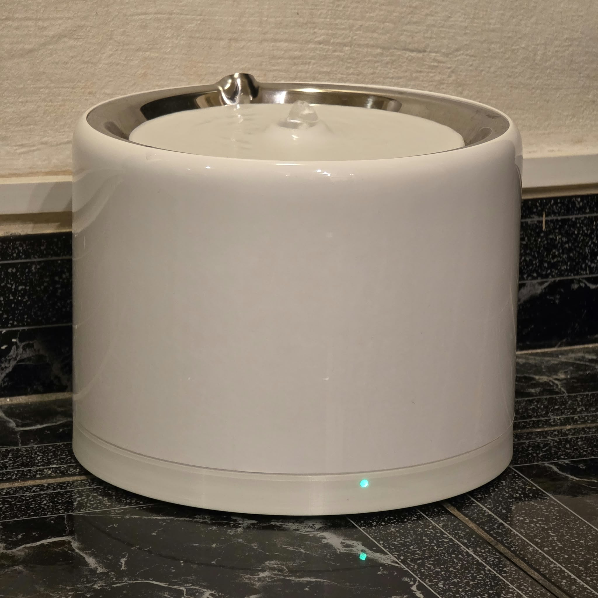
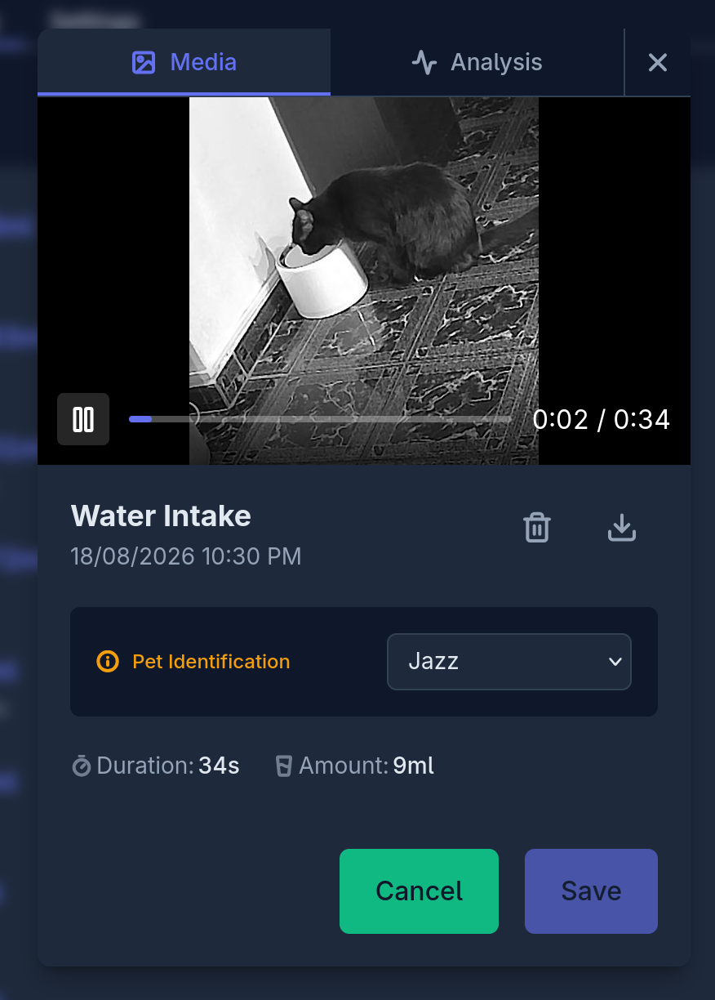

# @oddware/esphome.petkit-eversweet-3-pro

A replacement base for the **PetKit Eversweet 3 Pro UVC** water fountain that
weighs the whole fountain and logs every drink to Home Assistant. The fountain
itself is untouched — it sits on the new base and gets its power the same way
it always did, inductively, through its own coil.

| In service | A drink, logged |
|:---:|:---:|
|  |  |

## Why

The Eversweet 3 Pro is a genuinely good fountain. It strips down in seconds,
there's nothing awkward to scrub, and the UVC and filters keep it pleasant to
live with. But it has no scale, so it can't tell you how much your cat
actually drank. The app offers runtime counters and filter reminders
instead, and even those go through PetKit's cloud and an account.

So the fountain stays as-is and the base under it gets replaced. Four load
cells weigh the entire fountain continuously; every drink is logged with
volume and duration, straight into Home Assistant over the local API. No
cloud, no account, and the cleaning routine doesn't change.

Ironically, the stock base already has most of this on its one board — a
current-sense ADC, a switching transistor, a BLE chip. It just does it all
for PetKit. This base keeps only the dumb part, the coil and its driver, and
redoes the smarts with parts an ESP32 can run: an INA219 for the current
sensing, a MOSFET for the switching, and a scale, which the original never
had. The coil comes out of the stock base on double-sided tape and
a connector, no soldering, so a fresh sticky pad puts everything back to
stock if you ever want out.

## What it does

- Water volume and fill level (mL and %) from 4 load cells + HX711
- Drinking events with volume and duration, plus an `Activity` binary sensor
- Pump on/off as a Home Assistant switch, and pump power draw from the INA219
- Water-change and filter-change reminders with configurable intervals and
  reset buttons
- RGB status LED through a light guide: colour = water level, breathing =
  consumable overdue, blue = Wi-Fi down, purple strobe = tare/calibration
- Runtime tare and known-weight calibration from Home Assistant, persisted
  across reboots

## What you'll need

- The fountain, and its stock base as the coil donor
- A 3D printer with a ~200 mm bed, and PLA
- The electronics — ESP32-C3 SuperMini, HX711 + 4 half-bridge load cells,
  INA219, LR7843 — plus connectors, an O-ring, an acrylic rod, and 22 M3
  screws; full list in [hardware.md](hardware.md#parts-to-buy)
- A donor **Tefal Optiss kitchen scale** for its
  [load-cell feet](hardware.md#about-those-load-cell-feet)
- Soldering iron, XH2.54/Dupont crimper, multimeter, hot glue gun
- Somewhere for the data to go: Home Assistant, or
  [cat-health](https://github.com/cristianchelu/cat-health), which speaks
  the ESPHome protocol natively — no HA required

## Telling the cats apart

A scale can't tell which cat is drinking, and in a multi-cat house per-cat
intake is the number that matters. That part is solved outside this project:
point a camera at the fountain, trigger a snapshot off the `Pet Drinking`
event, and have a vision model ([OpenRouter](https://openrouter.ai) or
similar) identify the cat.

Pairs well with
[cristianchelu/cat-health](https://github.com/cristianchelu/cat-health),
the nexus of everything cat-related around here — feed it the per-cat
drinks and this goes from a fountain that logs weights to actual health
monitoring.

## Home Assistant entities

| Entity | Type | Notes |
|--------|------|-------|
| Water Amount | sensor, mL | Stable weight minus `bowl_weight` |
| Water Level | sensor, % | Scaled between `water_mark_min` and `water_mark_max` |
| Water Rate of Change | sensor, mL/min | Diagnostic; drives drinking detection |
| Coil Power | sensor, W | INA219 on the transmitter supply |
| Last drink amount / duration | sensor | Published on each qualifying drink event |
| Water / Filter Time Remaining | sensor, days | |
| Water / Filter Change Due | sensor, timestamp | |
| Calibration Last Performed | sensor, timestamp | Diagnostic |
| Scale / Unfiltered Weight | sensor, g | Diagnostic, disabled by default |
| Scale Tare Offset / Coefficient | sensor | Diagnostic, disabled by default |
| WiFi Signal | sensor, dBm | Diagnostic; median of four samples, once a minute |
| Activity | binary_sensor | Motion class, `delayed_off` 10 s |
| Vibration Detected | binary_sensor | Diagnostic; gates tare and calibration |
| Operation Mode | text_sensor | Normal / Tare / Calibration |
| Pump | switch | Gates the wireless transmitter. `restore_mode: ALWAYS_ON` |
| Status LED | light | Single WS2812 |
| Status LED Brightness | select | Low / Medium / High |
| Calibration Known Weight | number, g | |
| Water / Filter Change Interval | number, days | |
| Water Changed / Filter Changed | button | Resets the corresponding timer |
| Tare Scale / Calibrate Scale / Cancel Calibration | button | |
| Pet Drinking | event | Fired per qualifying drink |

## Flash

1. Copy [`secrets.yaml.example`](secrets.yaml.example) to `secrets.yaml`
   (gitignored) and set Wi-Fi, API, and OTA credentials.
2. Validate and flash [`petkitwaterfountain.yaml`](petkitwaterfountain.yaml):

   ```bash
   esphome config petkitwaterfountain.yaml
   ```

   ```bash
   esphome run petkitwaterfountain.yaml
   ```

The ESP32-C3 SuperMini builds as `esp32-c3-devkitm-1` on ESP-IDF. First flash
over USB, OTA after that.

## Calibrate

> **Put it on a flat, hard surface first.** A four-footed scale only reads
> right when all four feet carry load. On a rug or a rocking tile you get
> drifting baselines and phantom drinking events, and no amount of
> calibration will fix it.

The scale weighs the whole fountain, so "tare" means *with the fountain
lifted off the base*, not with an empty reservoir.

1. Lift the fountain off. Press **Tare Scale** — the LED strobes purple
   while the firmware waits for vibration to settle, then the reading is
   stored as the tare offset.
2. For a full calibration, set **Calibration Known Weight**, press
   **Calibrate Scale** with the base empty, then place the known mass when
   the strobing speeds up. A green flash means the new coefficient stuck.
3. Set the `bowl_weight` substitution to the dry weight of the fountain —
   body, pump, spout, filter, empty reservoir. It's subtracted to get Water
   Amount, so getting it wrong shifts every reading.
4. Set `water_mark_min` / `water_mark_max` to the mL readings you want shown
   as 0 % and 100 %.

Calibration survives reboots. To restore a known-good pair without redoing
the physical flow, call the `set_calibration` API action with `tare` (int)
and `coefficient` (float).

The default `scale_coefficient` is negative (`-282.8`). The sign only
depends on which way round the load-cell bridge was wired; the firmware
handles either.

## Build

Print the parts, order the rest, and assemble per [hardware.md](hardware.md).

Two of the steps involve glue — the coil shell bonds into the outer shell,
and the USB-C pass-through gets sealed with hot melt — so dry-fit and
power-test everything first.

## Roadmap

- [ ] A capacitive button on the base to mark water/filter changed without
  reaching for Home Assistant.
- [ ] Foreign-object detection via the INA219 — needs auto-calibration of
  what normal draw looks like first.
- [ ] UVC state as a sensor. The fountain's UVC LED is visible in coil
  power as a ~80 mW step over the ~0.63 W pump baseline, and its schedule
  is deterministic: 3 h on at power-on, then 3 h off / 1 h on repeating.
  Since the firmware controls the fountain's power, it knows when that
  clock started — so a timer replaying the pattern predicts UVC state
  open-loop, and the power reading only has to confirm it. Two known-when
  states to tell apart beats detecting edges blind.
