# Hardware and enclosure

The power transfer between base and fountain is dumb: the base energises a
coil, the fountain picks it up inductively, and there's no data link through
it — the fountain runs whenever the coil is on. Nothing to reverse engineer.

The replacement base keeps that coil and its driver board, and rebuilds the
rest of the stock board's functions from breakouts an ESP32 can run — plus
the scale. See [Why](README.md#why).

| Finished | Underside |
|:---:|:---:|
| 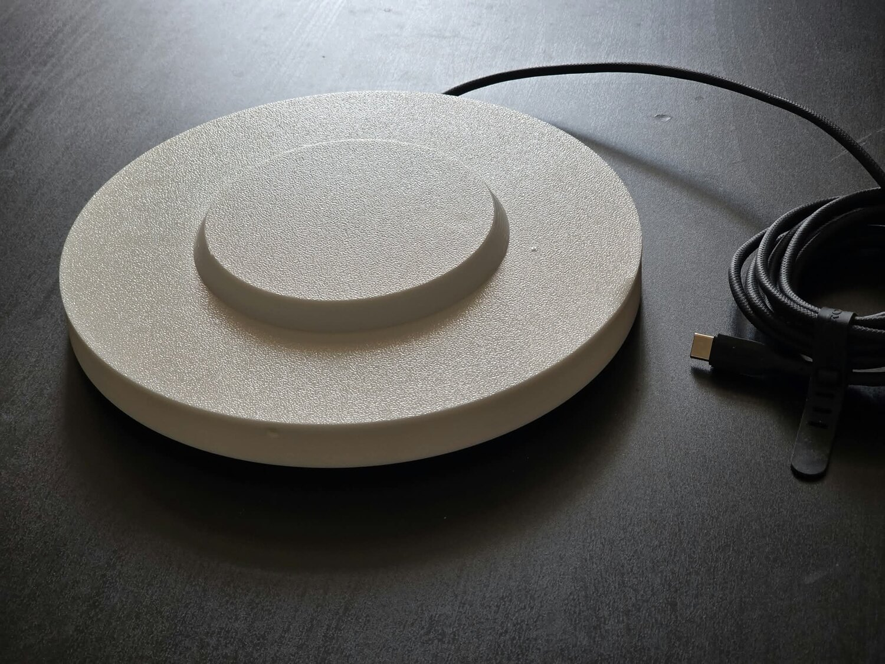 | 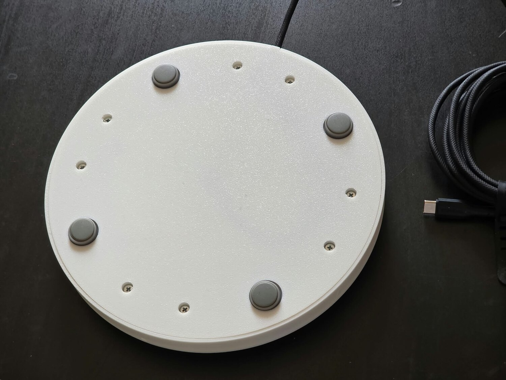 |

Closed up, the only things on the outside are the four load-cell feet, eight
screws, the USB-C cable, and one 3 mm dot of light.

## Shucking the original base

The coil and its driver board are held in the stock base with double-sided
tape only, and the input lead meets them at a connector. Nothing is soldered
to the housing.

1. Open the original base.
2. Peel the coil and the driver PCB off their sticky pads.
3. Unplug the input lead.

That's the whole shuck. Keep the original housing — a fresh sticky pad and
the connector put everything back to stock.

## CAD and print files

| Property | Value |
|----------|-------|
| Name | Eversweet Pro 3 (UVC) Base, v31 |
| Tool | Autodesk Fusion 360 |
| Archive | [`models/eversweet_pro_3_uvc_base.f3z`](models/eversweet_pro_3_uvc_base.f3z) |

Print files live in `models/`, one `*.3mf` per part — plain mesh exports, not
slicer projects, so set your own process settings. Plain PLA is fine; nothing
is load-bearing beyond the fountain's own weight and nothing gets hot.

| Part | File | Bounding box |
|------|------|--------------|
| Outer shell | [`outer_shell.3mf`](models/outer_shell.3mf) | 195.0 × 195.0 × 17.0 mm |
| Coil shell | [`coil_shell.3mf`](models/coil_shell.3mf) | 115.4 × 113.0 × 18.2 mm |
| Coil cap | [`coil_cap.3mf`](models/coil_cap.3mf) | 115.4 × 130.5 × 13.5 mm |
| Bottom shell | [`bottom_shell.3mf`](models/bottom_shell.3mf) | 192.8 × 190.8 × 6.0 mm |

The Fusion archive also carries a linked **Kitchen Scale Load Cell**
component — the foot the four load-cell pockets are modelled around. If you
need to adapt the design to different cells (see
[the load cell feet](#about-those-load-cell-feet)), that's the component to
edit.

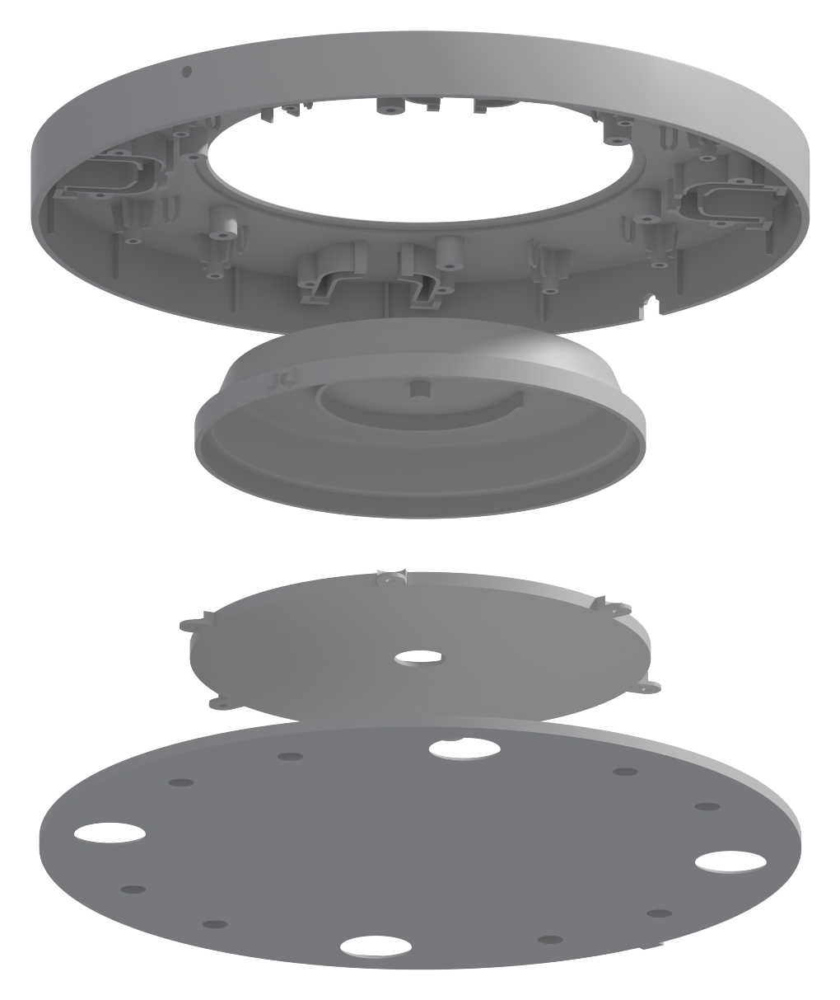

Build order, bottom to top: **bottom shell** (load cells and feet), **coil
cap** (all the boards), **coil shell** (the coil), and the **outer shell**
over the whole lot.

### Outer shell + coil shell

| Outer shell | Coil shell |
|:---:|:---:|
| 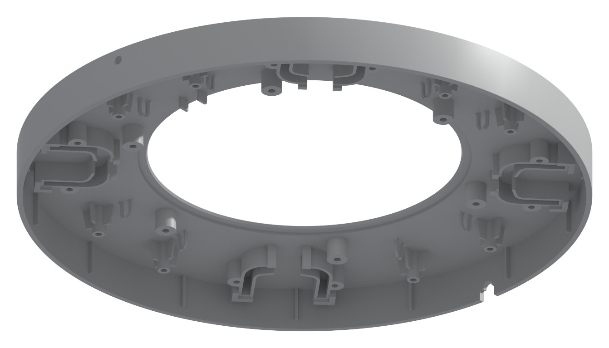 | 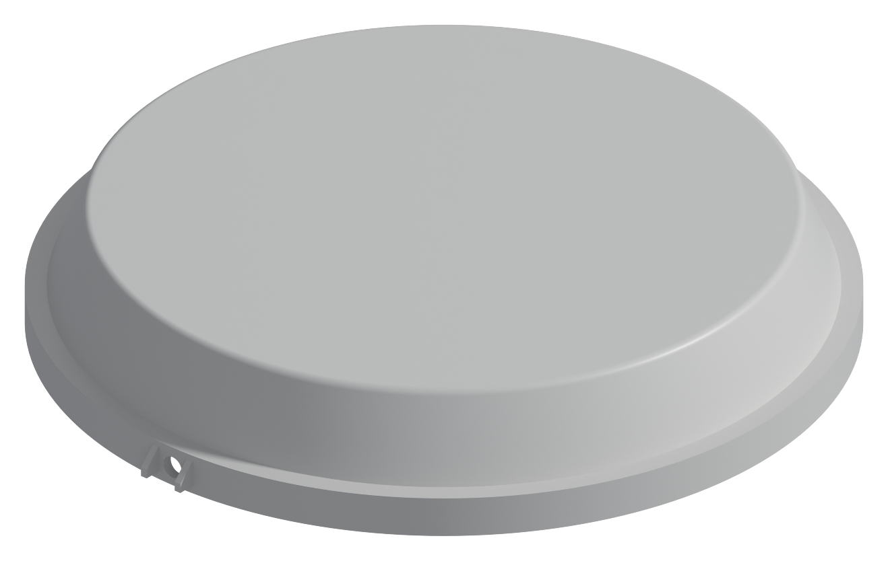 |

These two glue together into the top shell — the coil shell's lip drops into
the outer shell's bore, and two pairs of notches index the rotation. The
same notches line up the light-guide holes, so dry-fit with the rod through
as a gauge before glue. The coil sits in the coil shell over the centre
boss, leads out through the floor slot.

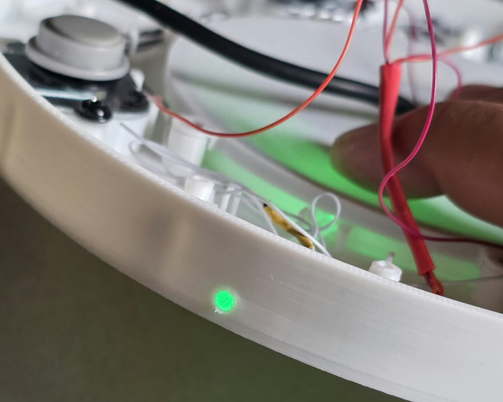

The light guide mid-assembly, held by clips on its way out through the
front wall.

### Coil cap

| Top | Underside |
|:---:|:---:|
| 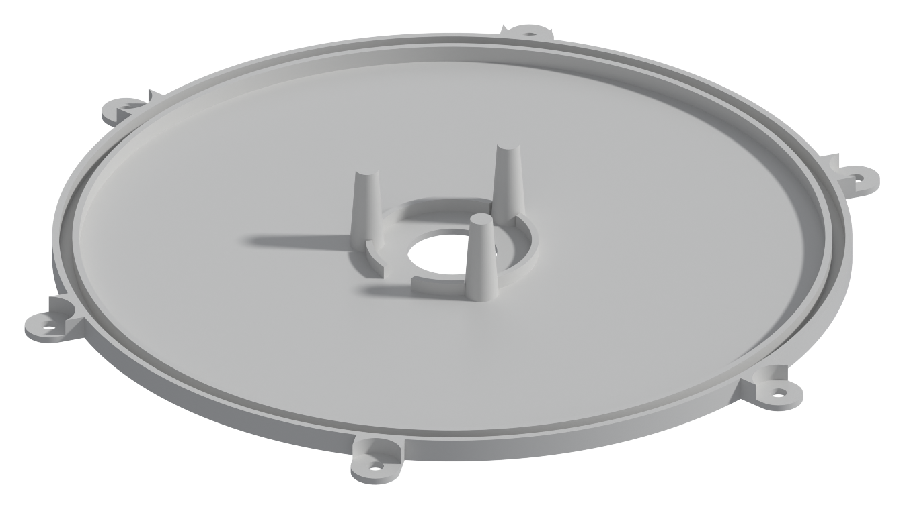 | 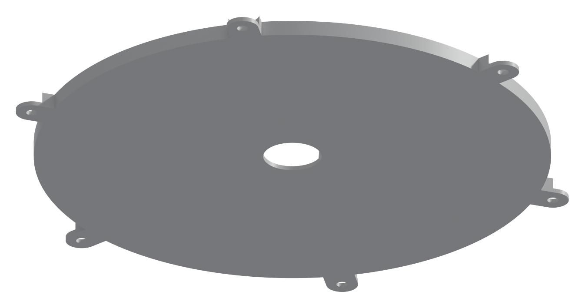 |

Closes the enclosure against the coil shell — **110 × 2 mm O-ring** in the
groove, **6 × M3×9** through the tabs. Its upper face doubles as the
electronics deck: the ESP32-C3, HX711, INA219, and LR7843 all tape flat to
it, inside the roughly **⌀105 mm** circle the O-ring groove leaves you, with
no second layer to escape to. Breakout form factors vary, so nothing marks
where each board goes — except that the **ESP32-C3's onboard WS2812 has to
end up very close to the light-guide rod without touching it** (the gap sets
how bright the LED reads from outside). Place it first, fit the rest around
it.

The ⌀13 mm hole through the centre collar is the USB-C pass-through; it gets
sealed with hot melt glue at the very end, after everything checks out.

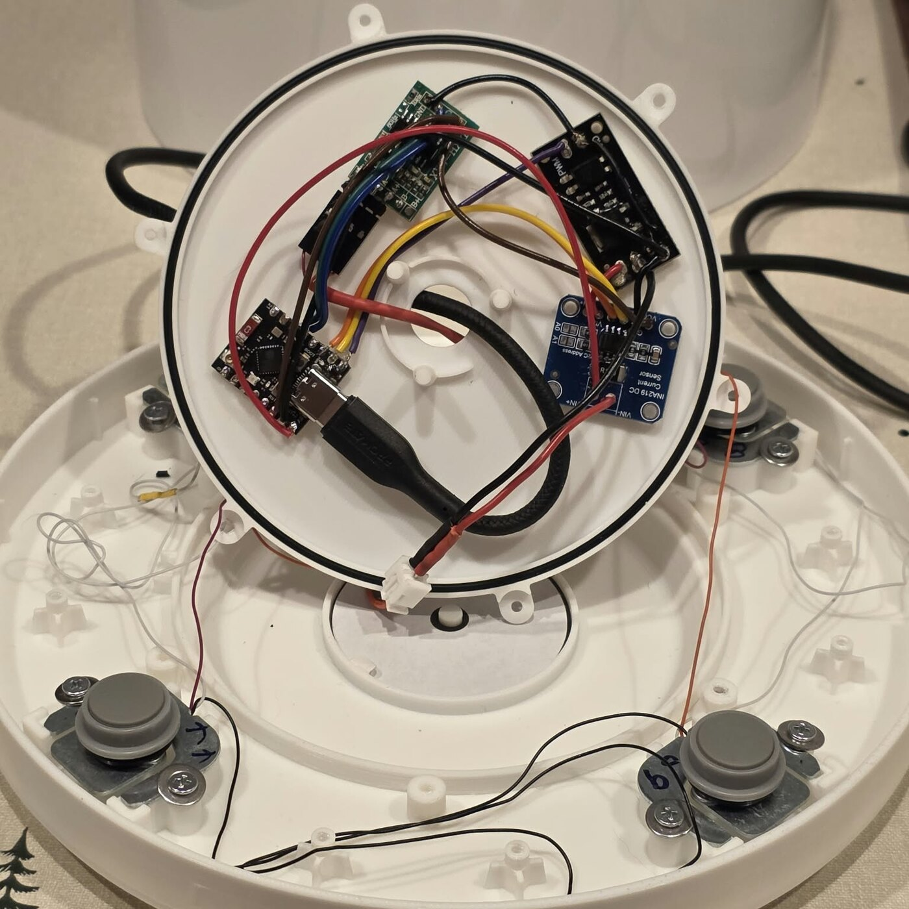

### Bottom shell

| Top | Underside |
|:---:|:---:|
| 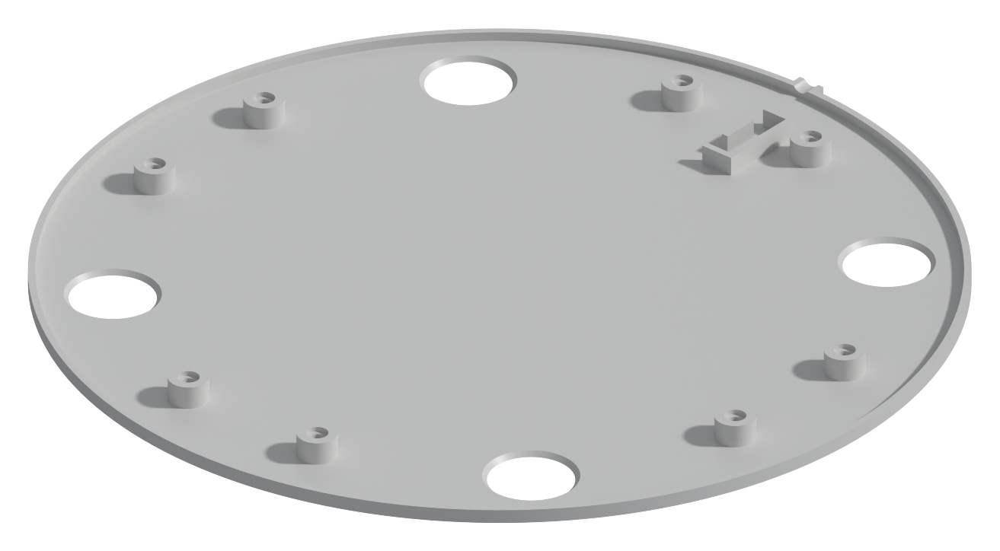 | 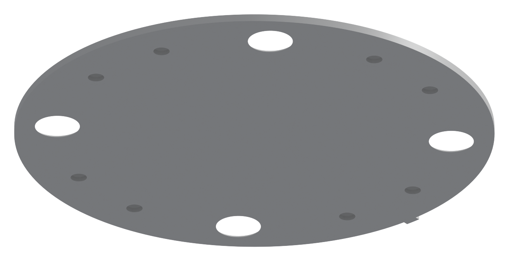 |

Four **⌀17.9 mm** openings let the load-cell feet reach the table — size
your feet around ⌀16 mm so they clear rather than bind. Moulded clips route
the load-cell wiring, and the slot at the edge is strain relief for a 4 mm
USB-C cable.

## Parts to buy

| Role | Part | Notes |
|------|------|-------|
| Wireless power | Coil + driver module | Shucked from the original base. |
| Compute | ESP32-C3 SuperMini, external antenna variant | Must have the onboard addressable RGB LED and a u.FL connector. |
| Coil switching | LR7843 low-side MOSFET breakout | If yours is optoisolated, bridge the GNDs — see below. |
| Current sensing | INA219 breakout | 0.1 Ω shunt, address 0x40, configured for 16 V / 3.2 A. |
| Scale ADC | HX711 breakout | |
| Load cells | 4 × half-bridge, 5 kg total | See [the feet](#about-those-load-cell-feet) before ordering. |
| Coil connector | 2-pin XH2.54 female | Mates the driver module's existing header — this is what makes the shuck solder-free. |
| Load cell connector | 4-pin Dupont | Between the HX711 and the load-cell harness, so the two halves of the base can separate. |
| Power inlet | USB-C cable, 3 m+, 4 mm braided | Diameter matters — the strain relief channel is sized for 4 mm. |
| Seal | 110 × 2 mm NBR O-ring | Sourced as Diesel Technic `10.30652` from a car parts shop. |
| Light guide | 3 × 50 mm clear acrylic rod | |

### About those load-cell feet

The four pockets are modelled around the feet of a **Tefal Optiss kitchen
scale**, because that's what was on hand when this was designed — and its
footprint turned out to be a snowflake that matches nothing on AliExpress.
If you can find an Optiss on clearance (or as a gift from mom), a few
dollars buys all four feet and you're done. If you can't, the foot is a
separate linked component in the Fusion archive, so re-cutting the pockets
for cells you can actually buy is an edit rather than a re-model — and a PR
with your footprint would be very welcome.

### Fasteners

**22 × M3×9 self-tapping**, one size throughout:

| Count | Where |
|-------|-------|
| 8 | Load cells to the bottom shell — 2 per foot |
| 6 | Coil cap to the coil shell |
| 8 | Bottom shell to the top shell |

6–9 mm all work; **don't go to 10 mm** — the walls are thin by design and a
10 mm screw will all but break through. Pan or button head
(domed top, flat underside), not countersunk — a countersink wedges a
printed boss apart as it seats.

### Consumables

| Item | Why |
|------|-----|
| Double-sided tape | Mounts the four boards to the coil cap and re-sticks the shucked coil and driver. Use good tape (Tesa, 3M) — a board that lets go inside a sealed base means a full strip-down. |
| Glue | Bonds the coil shell into the outer shell. Permanent. |
| Hot melt glue | Seals the coil cap's centre hole around the USB-C cable. |
| Heatshrink tubing | Over the load-cell wires wherever they'll be buried in hot melt — they're hair-thin, and the tubing is what lets you cut the glue away later without nicking them. |
| PLA filament | The four printed parts. |

## Wiring

Pin assignments are the ones the firmware uses, from
[`petkitwaterfountain.yaml`](petkitwaterfountain.yaml):

| Signal | ESP32-C3 GPIO |
|--------|---------------|
| I²C SCL (INA219) | GPIO6 |
| I²C SDA (INA219) | GPIO7 |
| HX711 DOUT | GPIO9 |
| HX711 SCK | GPIO10 |
| LR7843 gate (pump switch) | GPIO5 |
| Onboard WS2812 status LED | GPIO8 |

I²C runs at 400 kHz, HX711 pins with pullups. The INA219 is wired supply
into `Vin+`, load out of `Vin−`; reversed, it just reports negative numbers.

[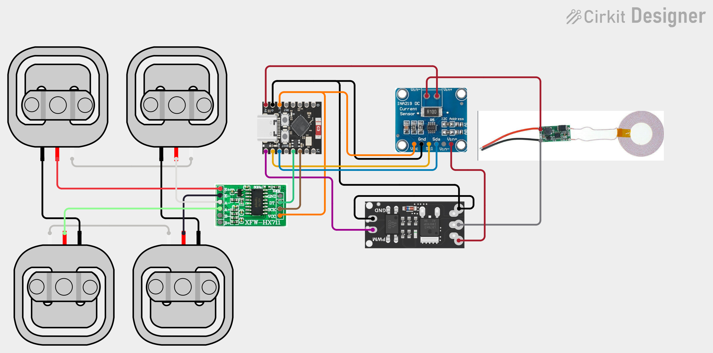](https://app.cirkitdesigner.com/project/620689bb-c6b9-48aa-a28e-95eec54fc33b)

Wire colours are arbitrary. One net is worth keeping straight, though: the
coil return lands on the driver's black lead so it looks like ground, but
the MOSFET sits in that leg — with the pump off it floats near supply, not
at 0 V.

### Power path

Everything runs off the one USB-C cable, plugged directly into the ESP32-C3.
The coil supply is tapped off the ESP32-C3's **5 V pin** (USB VBUS) and runs
through the INA219 and the MOSFET to the driver, via the XH2.54 connector —
so the INA219 reads only the coil's draw, not the ESP32's. Logic power for
the INA219 and HX711 comes off the **3.3 V pin**; running the HX711 at 5 V
would put 5 V on `DT` into a 3.3 V input.

The LR7843 switches the **low side**, so the ESP32 keeps a common ground
with everything — that's the whole point of using a low-side part here.

Two things worth knowing: the whole fountain's power passes through the
SuperMini's USB-C connector and 5 V trace, so think twice before swapping in
a hungrier pump or coil driver. And the `Pump` switch has `restore_mode:
ALWAYS_ON`, so a reboot or firmware crash leaves the water running rather
than silently turning it off.

### LR7843: bridge the grounds

The board used here is optoisolated — an EL817 on the input side, load side
on its own ground. That doesn't work in this circuit: the MOSFET switches
the low side and the INA219 needs the same reference. **Jumper the input GND
to the load GND** — the pads are too far apart for a solder bridge, so run a
wire. If yours is already continuous, nothing to do.

### Load cells to HX711

The four half-bridge cells combine into one full bridge across the HX711's
`E+`, `E-`, `A+`, `A-` — see the diagram. Pair the cells' white wires across
the top and bottom, pair the blacks down each side, and take the bridge out
on the reds. Out to the HX711 it follows the SparkFun colour code: `E+` red,
`E-` black, `A-` white, `A+` green.

The cells' own wire colours vary by manufacturer, so ring yours out with a
multimeter before trusting them — the two ends of a half bridge read roughly
double the resistance of either end to the centre tap. And don't sweat
polarity: a reversed bridge just means a negative calibration coefficient,
which is exactly what the shipped default (`-282.8`) is.

Terminate the harness in the 4-pin Dupont connector at the HX711 end —
the cells live on the bottom shell and the HX711 on the coil cap, so without
it you can't separate the two halves. Sleeve the wires in heatshrink
wherever they'll end up under hot melt glue.

## Assembly

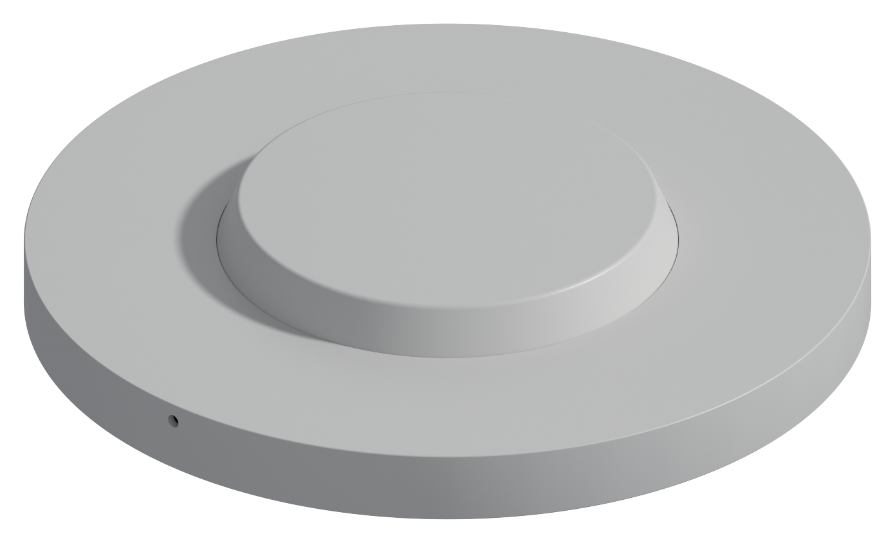

Dry-fit the whole thing before any glue goes anywhere.

1. Shuck the coil and driver module from the original base (above).
2. **Glue the top shell** — coil shell into outer shell, notches indexed,
   light-guide rod through as a gauge (see
   [above](#outer-shell--coil-shell)).
3. Seat the coil in the coil shell, leads out through the floor slot.
4. Mount the four load cells to the bottom shell, feet through the openings —
   2 × M3×9 per foot. Route the wiring through the clips and terminate it in
   the Dupont connector.
5. Lay the boards out on the coil cap's upper face — ESP32-C3 against the
   light guide first, the rest around it (see [Coil cap](#coil-cap)). Tape
   them down and wire per [Wiring](#wiring). Keep the antenna clear of the
   coil.
6. Fish the USB-C cable up through the coil cap's centre hole, plug it into
   the ESP32-C3, and lay it into the strain relief channel in the bottom
   shell.
7. Fit the O-ring and screw the cap to the coil shell — 6 × M3×9.
8. Fit the light guide: through the clips, out through the front bore, inner
   end just clear of the WS2812.
9. Power up and check: the LED should read brightly through the guide (dim
   means the gap is too big) and the scale should respond.
10. Seal the coil cap's centre hole around the USB-C cable with hot melt
    glue.
11. Close up — 8 screws through the bottom shell into the top shell.
12. Stand it on a flat, hard surface, set the fountain on top, and
    [calibrate](README.md#calibrate).
